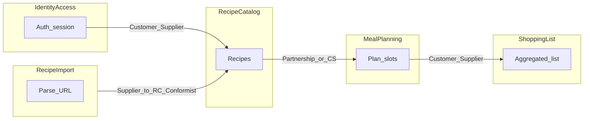

# Доменные контексты и материал для Event Storming

Документ служит **опорой для фасилитации** [Event Storming](https://www.eventstorming.com/) и построения карт контекстов (DDD). Это **рабочие гипотезы** до воркшопа: границы контекстов и названия событий команда может уточнить на стикерах.

**Связанные артефакты:**

- Оглавление папки `docs/`: [README.md](./README.md)
- Бизнес-требования и сценарии: [business-doc.md](./business-doc.md)
- **Вход для архитектурных решений и ADR:** [architecture-decision-context.md](./architecture-decision-context.md)
- UX, экраны и прототип Figma: [design-plan.md](./design-plan.md), [technical-spec-figma.md](./technical-spec-figma.md)

---

## 1. Стратегический уровень: карта ограниченных контекстов

### 1.1. Предлагаемые bounded contexts

| Контекст | Кратко | Типичные экраны / фреймы (см. ТЗ) |
|----------|--------|-------------------------------------|
| **Identity & Access** | Регистрация, вход, сессия, минимальный профиль (смена пароля, выход) | `SCR / Вход`, `SCR / Регистрация`, `SCR / Профиль` (план) |
| **Recipe Catalog** | Личная библиотека рецептов: CRUD, метаданные, заметки, пищевая ценность, категория приёма пищи | `SCR / Библиотека рецептов`, `SCR / Рецепт`, `SCR / Редактор рецепта`, пустое состояние |
| **Recipe Import** | Проверка URL, парсинг разрешённых сайтов, маппинг в черновик рецепта, ошибки домена | `MOD / Импорт по URL — ввод|загрузка|ошибка` |
| **Meal Planning** | Недельный план, фиксированные слоты приёмов пищи, назначение рецептов на дни/слоты, поиск в панели | `SCR / Планировщик`, календари выбора дня, `SCR / Планировщик — из рецепта` |
| **Shopping List** | Период, агрегация ингредиентов по плану, группировка по категории продукта, чекбоксы, ручные строки, экспорт | `SCR / Список покупок`, пустое состояние, `Panel / Период для списка покупок` |

**Альтернатива (узкий монолит на воркшопе):** объединить **Recipe Import** в **Recipe Catalog** как подпроцесс; тогда на стратегической карте показать его как **модуль**, а не отдельный контекст.

### 1.2. Связи между контекстами (гипотезы для карты)

Нотация в духе [Context Mapping](https://www.infoq.com/articles/ddd-contextmapping/): отношения **не финальны**.

| От | К | Предполагаемый тип связи | Комментарий |
|----|---|---------------------------|-------------|
| Identity & Access | Recipe Catalog | **Customer–Supplier** | Данные рецептов принадлежат пользователю; каталог не живёт без идентичности. |
| Recipe Import | Recipe Catalog | **Supplier → Customer** (часто **Conformist** к форме черновика) | Импорт обязан укладываться в модель рецепта каталога. |
| Recipe Catalog | Meal Planning | **Partnership** или **Customer–Supplier** | План ссылается на рецепты; изменения состава рецепта влияют на будущие планы. |
| Meal Planning | Shopping List | **Customer–Supplier** | Список строится из плана и периода; период задаётся в зоне планирования. |

На воркшопе уточнить: нужен ли отдельный **Anti-Corruption Layer** между импортом и каталогом (если поля источника сильно отличаются).

---

## 2. Единый язык (Ubiquitous Language)

Термины согласовать с [business-doc.md](./business-doc.md). В колонке «UI» — ориентир по [technical-spec-figma.md](./technical-spec-figma.md).

| Термин | Определение | Где в продукте | Синонимы / запреты |
|--------|-------------|----------------|--------------------|
| Рецепт | Сущность с названием, ингредиентами, шагами, временем, пищевой ценностью, категорией приёма пищи | Recipe Catalog | «Блюдо» только в UI-тексте, в коде домена лучше **Recipe** |
| Ингредиент | Строка с названием, количеством или «по вкусу», единицей, **категорией продукта** | Редактор, список покупок | Не путать с позицией списка покупок после агрегации |
| Категория продукта | Молочные, мясо, бакалея, овощи, прочее — для группировки в списке покупок | Badge в UI, поле ингредиента | Не смешивать с **категорией приёма пищи** у рецепта |
| Слот приёма пищи | Одно из **шести** фиксированных мест в дне (завтрак … поздний ужин) | Meal Planning | Не «приём пищи рецепта» в смысле поля рецепта — уточнять по контексту |
| План (на период) | Назначения рецептов по дням и слотам | Планировщик | |
| Период для покупок | Диапазон дат для расчёта списка | Панель на планировщике, календарь периода | |
| Список покупок | Агрегированные позиции на период с группировкой | Shopping List | |
| Импорт по URL | Операция с проверкой разрешённого домена и парсингом | Recipe Import | «Парсинг» — технический синоним в интеграции |

---

## 3. Тактический уровень: заготовки по контекстам

На воркшопе заполнять стикерами: **команда** (оранжевый), **событие** (оранжевый пастель), **агрегат**, **политика**, **чтение**, **внешняя система**.

### 3.1. Identity & Access

- **Команды / действия:** зарегистрироваться, войти, выйти, сменить пароль.
- **События (черновики):** `ПользовательЗарегистрирован`, `ПользовательВошёлВСистему`, `ПользовательВышел`, `ПарольИзменён`.
- **Агрегат:** User / Account (уточнить).
- **Политики:** правила сложности пароля, блокировки (вне MVP).
- **Read models:** нет отдельного тяжёлого read-модели кроме сессии.
- **Внешние системы:** почта (если появится сброс пароля).

### 3.2. Recipe Catalog

- **Команды:** создать рецепт, изменить рецепт, удалить рецепт; сохранить после редактирования.
- **События:** `РецептСоздан`, `РецептИзменён`, `РецептУдалён`; после импорта — часто `РецептСоздан` или `ЧерновикРецептаСозданИзИмпорта` (уточнить).
- **Агрегат:** Recipe (инварианты: принадлежность пользователю, обязательные поля для публикации в план — уточнить).
- **Политики:** валидация единиц и категорий продуктов.
- **Read models:** библиотека (поиск, фильтры), карточка просмотра.
- **Внешние системы:** нет (кроме косвенно через Import).

### 3.3. Recipe Import

- **Команды:** запросить импорт по URL, отменить, повторить с другим URL.
- **События:** `ИмпортЗапрошен`, `ИмпортУспешен`, `ИмпортОтклонёнНеподдерживаемыйДомен`, `ИмпортНеУдалсяОшибкаСетиИлиПарсинга`.
- **Агрегат:** ImportJob / ParsingSession (уточнить — или процесс без долгого состояния).
- **Политики:** whitelist доменов MVP.
- **Read models:** состояние загрузки в UI.
- **Внешние системы:** **кулинарные сайты** (два разрешённых), HTTP.

### 3.4. Meal Planning

- **Команды:** открыть план на неделю, выбрать день, назначить рецепт в слот, убрать из слота, перенести (DnD = одна команда в домене); открыть календарь из библиотеки / с экрана рецепта.
- **События:** `ДеньПланаВыбран`, `РецептНазначенНаСлот`, `РецептУдалёнИзСлота`, `РецептПеренесёнМеждуСлотамиИлиДнями` (уточнить гранулярность).
- **Агрегат:** WeekPlan / DayPlan / Slot (уточнить границу транзакции).
- **Политики:** не более N рецептов в слоте (если появится лимит); фиксированный набор слотов MVP.
- **Read models:** недельная сетка, боковая панель с поиском и фильтрами.
- **Внешние системы:** нет.

### 3.5. Shopping List

- **Команды:** задать период, сформировать список, отметить купленным, удалить строку, добавить свою позицию, экспортировать в буфер.
- **События:** `ПериодДляПокупокВыбран`, `СписокПокупокСформирован`, `ПозицияОтмеченаКупленной`, `ПозицияУдалена`, `СвояПозицияДобавлена`, `СписокЭкспортированВБуфер`.
- **Агрегат:** ShoppingList на период (пересчёт при изменении плана — **политика**).
- **Политики:** при изменении плана или периода пересобрать или инкрементально обновить список (решение на воркшопе).
- **Read models:** экран списка с группировкой по категориям.
- **Внешние системы:** **буфер обмена** ОС.

---

## 4. Матрица: пользовательские сценарии × контексты × события

Использование: при разборе сценариев 1–3 из [business-doc.md](./business-doc.md) отмечать, какие контексты и **ключевые события** задействованы (для нарезки потоков на стикеры).

| Сценарий (business-doc) | Основные контексты | Примеры событий для обсуждения |
|-------------------------|-------------------|--------------------------------|
| **1. Импорт по URL** | Import → Catalog | `ИмпортЗапрошен` → `ИмпортУспешен` → `РецептСоздан` / черновик сохранён |
| **2. Планирование на неделю** | Catalog, Meal Planning | `РецептНазначенНаСлот`, `РецептУдалёнИзСлота`, переносы |
| **3. Список покупок** | Meal Planning, Shopping List | `ПериодДляПокупокВыбран`, `СписокПокупокСформирован`, правки позиций, экспорт |

---

## 5. Как использовать на воркшопе

1. **Big Picture Event Storming:** пройти сценарии 1–3 по доменным событиям на оранжевых стикерах; не спорить о границах контекста на первом проходе.
2. **Стратегическая карта:** вынести на отдельную доску контексты из п. 1.1 и связи из п. 1.2; пометить **открытые вопросы** (импорт как подконтекст или нет).
3. **Тактика по зонам:** для каждого спорного агрегата взять секцию 3 и дописать инварианты и команды.
4. После воркшопа обновить этот файл или вынести итог в ADR / wiki команды — **этот документ не заменяет** решения, принятые на сессии.

---

*Доска в Figma (страница **DDD**):* секция **«DDD — Event Storming и карты контекстов»**, node id `3372:1312` (внутри — фрейм **Board root** `3372:1314`: легенда, стратегическая карта контекстов, Big Picture по сценариям 1–3, пять тактических колонок, блок Hot spots). Сборка через MCP **vibma** (плагин в том же канале, что и MCP).

*Опционально (репозиторий):* черновик импорта SVG — [design/ddd-board/ddd-event-storming-board.svg](../design/ddd-board/ddd-event-storming-board.svg), инструкция — [design/ddd-board/IMPORT.txt](../design/ddd-board/IMPORT.txt) (файлы могут отсутствовать до экспорта из Figma).

*Последняя синхронизация документа с макетом: 2026-03-22.*
