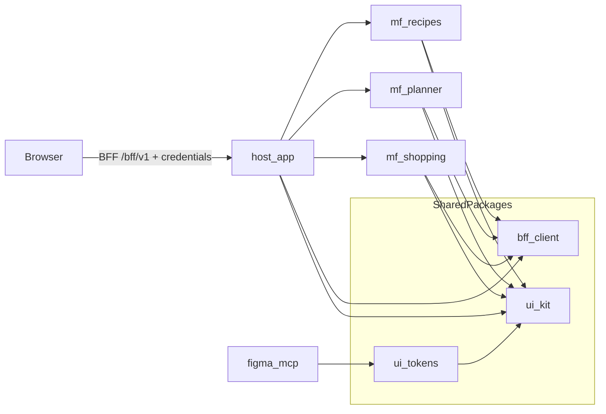

# Frontend architecture: host + MFE + shared foundation

Документ фиксирует единую архитектуру frontend для репозитория `family_meal-planning`: границы host и MFE, принципы FSD, shared packages, тестовую стратегию и roadmap миграции.

Связанные решения: [ADR 0001](./adr/0001-microservice-boundaries-bff-session-auth.md), [ADR 0002](./adr/0002-plan-aggregate-shopping-snapshot.md), [ADR 0003](./adr/0003-php-go-split-openapi.md), [ADR 0004](./adr/0004-frontend-architecture-baseline-fsd-uikit-storybook-tests.md), [ADR 0005](./adr/0005-design-tokens-figma-sync-governance.md).

---

## 1. Invariants and boundaries

- Браузер обращается только к BFF: `/bff/v1/...` с `credentials: 'include'`.
- Фронтенд не вызывает микросервисы напрямую.
- Новые BFF пути вносятся только через OpenAPI (`contracts/openapi/`) и синхронизируются с `contracts/bff-routes.md`.
- UI-решения должны быть совместимы с UX-правилами из `docs/design-plan.md` и фактической Figma-спецификацией из `docs/technical-spec-figma.md`.

---

## 2. Architecture model

---

## 3. Ownership model

### Host (`frontend/apps/host`)

- Shell layout, загрузка remotes, глобальная маршрутизация.
- Auth guard и сессионная навигация.
- Общее окружение MFE (router context, runtime config).
- Не владеет доменной UI-логикой рецептов/плана/покупок.

### MFEs (`frontend/apps/mf-recipes`, `mf-planner`, `mf-shopping`)

- Доменные страницы, фичи и состояния своего контекста.
- Используют shared foundation (`@meal/bff-client`, `@meal/ui-tokens`, `@meal/ui-kit`).
- Не дублируют primitives и составные базовые компоненты из `ui-kit`.

### Shared packages (`frontend/packages/*`)

- `ui-tokens`: семантические дизайн-токены.
- `ui-kit`: общий каталог UI-компонентов для всех MFE и host.
- `bff-client`: единый клиент BFF и shared API-типы.

---

## 4. FSD baseline for each MFE

Целевая структура внутри каждого MFE фиксируется как FSD-подмножество:

- `app` — bootstrap, providers, app-level routes.
- `pages` — route-level composition.
- `widgets` — крупные UI-блоки страницы.
- `features` — пользовательские действия и сценарии.
- `entities` — доменные сущности и их визуализация.
- `shared` — утилиты, ui-адаптеры, либы, конфиги.

Правила:

- Импорт допускается только вниз по слоям.
- Доменные сценарии не размещаются в `shared`.
- Повторяющийся UI между MFE переносится в `ui-kit`, а не копируется.

---

## 5. UI kit and Storybook policy

- `ui-kit` — единственный каталог shared UI components.
- Центральный Storybook запускается из `frontend/packages/ui-kit`.
- Каждый публичный компонент `ui-kit` обязан иметь stories:
  - базовый state;
  - интерактивный state;
  - edge-cases (ошибка, disabled, long content, loading если применимо).
- Stories являются contract surface для MFE и точкой визуальной регрессии.

Компоненты и паттерны, специфичные только для одного доменного потока, остаются в MFE до появления второго потребителя.

---

## 6. Testing strategy (frontend quality pyramid)

- **Unit/component tests**: обязательны для публичных компонентов `ui-kit` и shared utils.
- **Screenshot tests**: обязательны для ключевых stories `ui-kit` (desktop/tablet/mobile viewport matrix).
- **E2E tests (Playwright)**: покрывают сквозные пользовательские сценарии и интеграцию MFE через host.

Минимальный целевой gate в CI:

1. Build frontend workspaces.
2. Run unit/component tests.
3. Run visual regression for `ui-kit` stories.
4. Run e2e smoke/regression.

---

## 7. Tokens and Figma alignment

- Дизайн-контекст: `docs/technical-spec-figma.md` + Figma MCP.
- Кодовая проекция: `frontend/packages/ui-tokens`.
- Shared components в `ui-kit` используют только семантические токены.
- Hardcoded style values в shared components запрещены, кроме зафиксированных исключений в ADR 0005.

Изменения токенов проходят цикл:

1. propose (описание причины);
2. review (design + frontend);
3. sync (Figma и код);
4. verify (story + visual + parity checks).

---

## 8. Migration roadmap (documentation baseline)

### Wave 0: standards and contracts

- Утвердить ADR 0004/0005 и этот документ.
- Зафиксировать ownership, import rules, quality gates.

### Wave 1: shared foundation

- Подготовить `frontend/packages/ui-kit`.
- Поднять центральный Storybook.
- Подключить базовые unit + screenshot пайплайны.

### Wave 2: vertical slices in apps

- Перенести host на согласованный app shell contract.
- В каждом MFE мигрировать минимум один end-to-end slice на FSD + ui-kit.

### Wave 3: scale-out migration

- Массовый перенос повторяющегося UI в `ui-kit`.
- Удаление дублей, стабилизация stories, закрытие parity-расхождений.

---

## 9. Definition of Done for architecture phase

- Архитектурные документы и ADR синхронизированы между собой.
- Правила FSD, shared UI, Storybook и тестов зафиксированы в одном месте.
- Нет противоречий ADR 0001-0003 и контрактам BFF/OpenAPI.
- Есть формализованный process синхронизации токенов с Figma MCP.

---

## 10. Migration contracts (implementation)

### FSD import boundaries

- `app` может импортировать `pages`, `widgets`, `features`, `entities`, `shared`.
- `pages` может импортировать `widgets`, `features`, `entities`, `shared`.
- `widgets` может импортировать `features`, `entities`, `shared`.
- `features` может импортировать `entities`, `shared`.
- `entities` может импортировать только `shared`.
- `shared` не импортирует слои выше.

### Wave Definition of Done

- **Wave 1**
  - `ui-kit` пакет создан, stories добавлены для публичных компонентов.
  - Для shared компонентов есть unit tests и screenshot checks.
  - Компоненты `ui-kit` используют только токены из `@meal/ui-tokens`.
- **Wave 2**
  - Host и каждый MFE имеют минимум один мигрированный vertical slice.
  - Дубли локальных UI primitives заменены на `ui-kit`.
  - BFF доступ в приложениях использует shared adapter/singleton policy.
- **Wave 3**
  - CI включает unit/component, screenshot и e2e gates.
  - `ui-parity-checklist` не содержит критичных блокеров.
  - Legacy-дубли удалены или помечены как явный техдолг с owner и сроком.

### Migration KPI

- Доля экранов, использующих `ui-kit` компоненты.
- Покрытие публичных shared компонентов unit tests.
- Покрытие ключевых stories screenshot checks (mobile/tablet/desktop).
- Количество оставшихся локальных дублируемых primitives в MFE.
