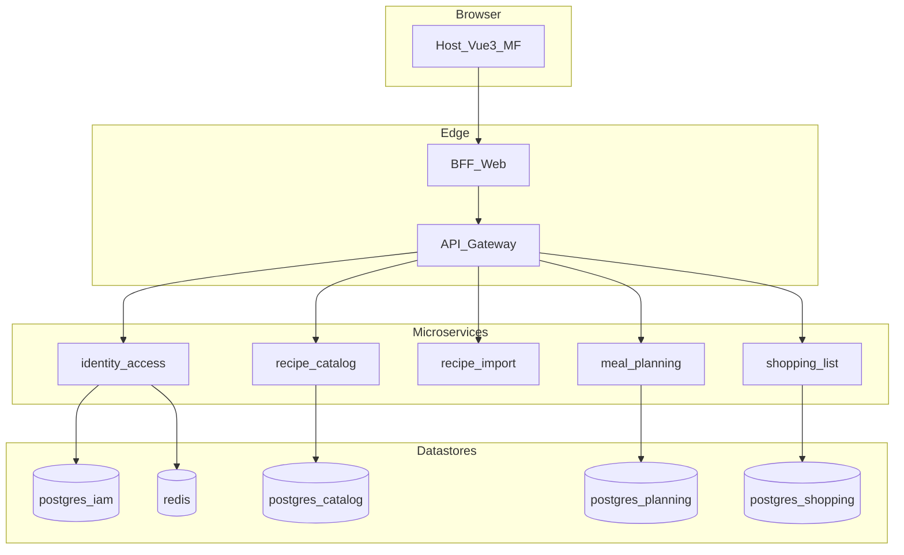

# Solution architecture: планировщик питания

Итоговая целевая архитектура MVP: микросервисы по bounded context, BFF для веб-клиента, микрофронты Vue 3. Решения зафиксированы в [adr/](./adr/).

**Связанные документы:** [architecture-decision-context.md](./architecture-decision-context.md), [business-doc.md](./business-doc.md), [domain-contexts-event-storming.md](./domain-contexts-event-storming.md), [bff-routes.md](../contracts/bff-routes.md).

---

## Логическая схема

---

## Сервисы, порты (локальная разработка) и БД

Значения портов — **соглашение по умолчанию**; при коллизиях изменить в `docker-compose` и документации.

| Компонент | Назначение | Порт (dev) | Хранилище |
|-----------|------------|------------|-----------|
| `bff-web` | Backend for Frontend, сессия, агрегация для UI | 8080 | — (stateless; Redis через IAM) |
| `identity-access` | Регистрация, вход, сессия | 8081 | PostgreSQL `iam`, Redis |
| `recipe-catalog` | CRUD рецептов | 8082 | PostgreSQL `catalog` |
| `recipe-import` | Импорт по URL | 8083 | нет обязательной БД на MVP |
| `meal-planning` | План, слоты | 8084 | PostgreSQL `planning` |
| `shopping-list` | Список покупок | 8085 | PostgreSQL `shopping` |
| API Gateway | TLS, маршрутизация, таймауты | 443 / 8443 | — |
| Prometheus | Метрики | 9090 | TSDB volume |
| Grafana | Дашборды | 3000 | — |
| Loki | Логи | 3100 | volume |
| OTel Collector | Трейсы/экспорт | 4317 gRPC | — |

Каждый сервис владеет **своей** логической БД (отдельная база или схема на одном инстансе PostgreSQL — по условиям деплоя).

**Локальная разработка (`infra/docker-compose.app.yml`):** отдельный контейнер **API Gateway** не поднимается; `bff-web` вызывает микросервисы напрямую по внутренним URI (`*_BASE_URI`). Это упрощение целевой схемы из ADR 0001 (BFF → Gateway → сервисы) для MVP на одной машине; в прод-среде gateway остаётся целевым компонентом на публичном периметре.

---

## Трассировка к требованиям

| ID | Требование | Реализация (высокий уровень) | ADR |
|----|------------|------------------------------|-----|
| FR-3.1 | Рецепты, CRUD | `recipe-catalog` | [0001](./adr/0001-microservice-boundaries-bff-session-auth.md), [0003](./adr/0003-php-go-split-openapi.md) |
| FR-3.1-import | Импорт с двух сайтов | `recipe-import` + whitelist; сохранение через catalog | [0003](./adr/0003-php-go-split-openapi.md) |
| FR-3.2 | Планировщик, DnD | `meal-planning`; UI в `mf-planner` | [0002](./adr/0002-plan-aggregate-shopping-snapshot.md) |
| FR-3.3 | Список покупок | `shopping-list`, снимок при формировании | [0002](./adr/0002-plan-aggregate-shopping-snapshot.md) |
| NFR-perf | Импорт 3–5 с, DnD | Gateway timeout; Go import; идемпотентные API плана | [0003](./adr/0003-php-go-split-openapi.md) |
| NFR-auth | Сервер, email/пароль | Cookie + Redis; BFF | [0001](./adr/0001-microservice-boundaries-bff-session-auth.md) |
| NFR-parse | Стабильность парсинга | Версии адаптеров, метрики, логи | [infra](../infra/docker-compose.observability.yml) |
| UC-1..3 | Сквозные сценарии | BFF + сервисы; e2e Playwright | [ci](../.github/workflows/ci.yml) |

---

## Поток запроса (пример)

Пользователь в планировщике нажимает «Сформировать список покупок»:

1. `POST /bff/v1/shopping/build` с `{ from, to }`, cookie сессии.
2. BFF валидирует сессию, ставит `X-Correlation-Id`, вызывает `shopping-list`.
3. `shopping-list` читает назначения у `meal-planning`, состав рецептов на момент расчёта у `recipe-catalog`, пишет строки со **снимком**, отвечает BFF.
4. BFF возвращает клиенту один JSON (например `listId` и URL для `mf-shopping`).

Подробнее: [0001](./adr/0001-microservice-boundaries-bff-session-auth.md), [0002](./adr/0002-plan-aggregate-shopping-snapshot.md).

---

## Фронтенд (микрофронты)

| Приложение | Роль | Dev порт |
|------------|------|----------|
| `frontend/apps/host` | Shell, роутер, загрузка remotes | 5173 |
| `frontend/apps/mf-recipes` | Библиотека, редактор, импорт | 5174 |
| `frontend/apps/mf-planner` | Календарь, неделя, DnD | 5175 |
| `frontend/apps/mf-shopping` | Список покупок | 5176 |

Общие токены: `frontend/packages/ui-tokens`. Сборка: см. [frontend/README.md](../frontend/README.md).
Единые правила frontend-архитектуры, ownership host/MFE, FSD-baseline, shared `ui-kit`, central Storybook и тестовая стратегия зафиксированы в [frontend-architecture.md](./frontend-architecture.md) и ADR [0004](./adr/0004-frontend-architecture-baseline-fsd-uikit-storybook-tests.md), [0005](./adr/0005-design-tokens-figma-sync-governance.md).

---

*Версия: 2026-03-24.*
